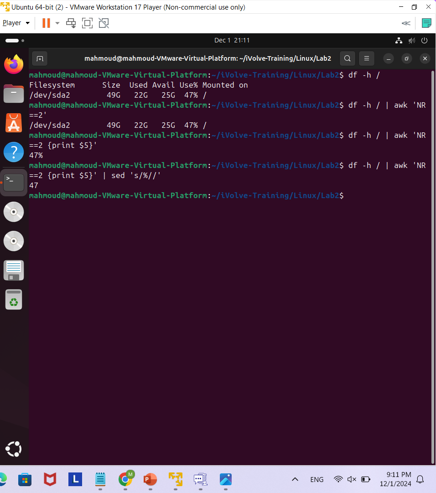
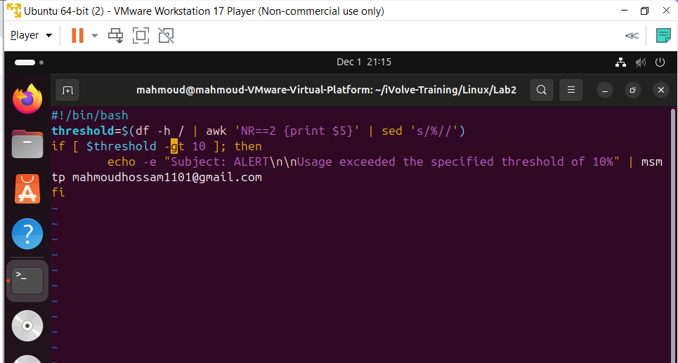
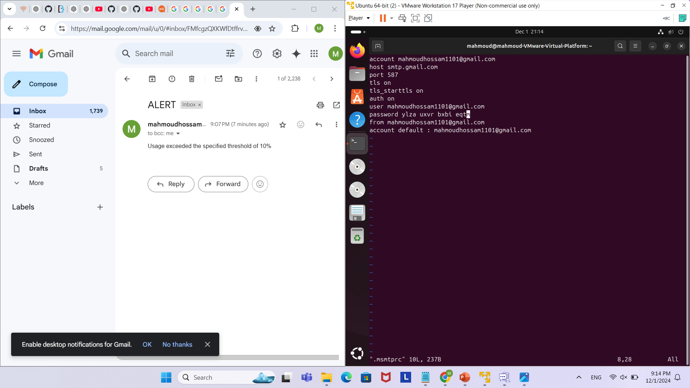
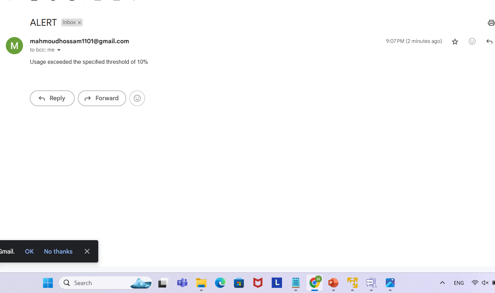
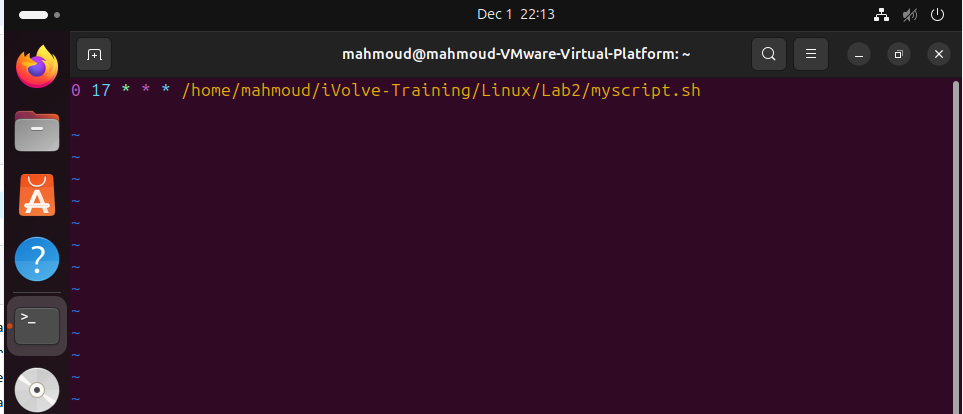

In Lab2 I had to create a shell script that would run daily at 5:00 PM to automate checking the disk space usage for the root file system, and if it exceeded a specified threshold of 10% the script would send an alert email.
So first of all before creating the bash script, I wanted to get a command that exaclty printed out the threshold disk usage percentage only.
So I tried the command " df -h / " and that printed me a lot of information, I only needed to get the pecentage which was on the second row fifth column. so I added on that command " df -h / | awk 'NR==2' " to only get the second row, then I added on it " df -h / | awk 'NR==2 | {print $5} '  " to only get the disk percentage usage then I wanted to remove the percentage to get the number only then for the final command "  df -h / | awk 'NR==2 {print $5}' | sed 's/%//'  "  and here is a screenshot for illustration:

After that I downloaded the msmtp and mailutils so that I can send an email to myself whenever the disk usage exceeds the 10%, so I made a new variable called threshold and assigned it the value of the df command as the number and compared it with 10 if it is greater, it will send an alert if not, it will not send on, here is the full bash script file for more illustration:

I had an issue where I sent an email it kept getting me an error, so the issue was in the configuration file for the msmtprc file, so I got an app password from my gmail so that I can add it in this file, as it does not accept the normal password, it has to be a 16 digit created app password, here the configuration file I made:

After that the script worked and I was able to recieve the email, here is a screenshot for it:

Then I edited the crontab file configuration to make the script run daily at 5 PM , using the crontab -e command like this:

