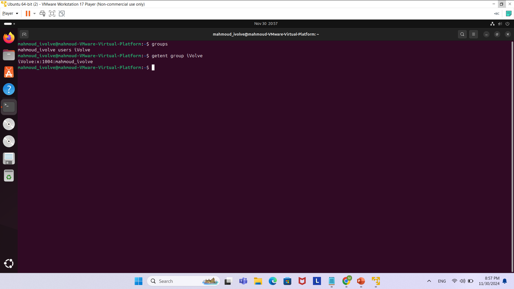
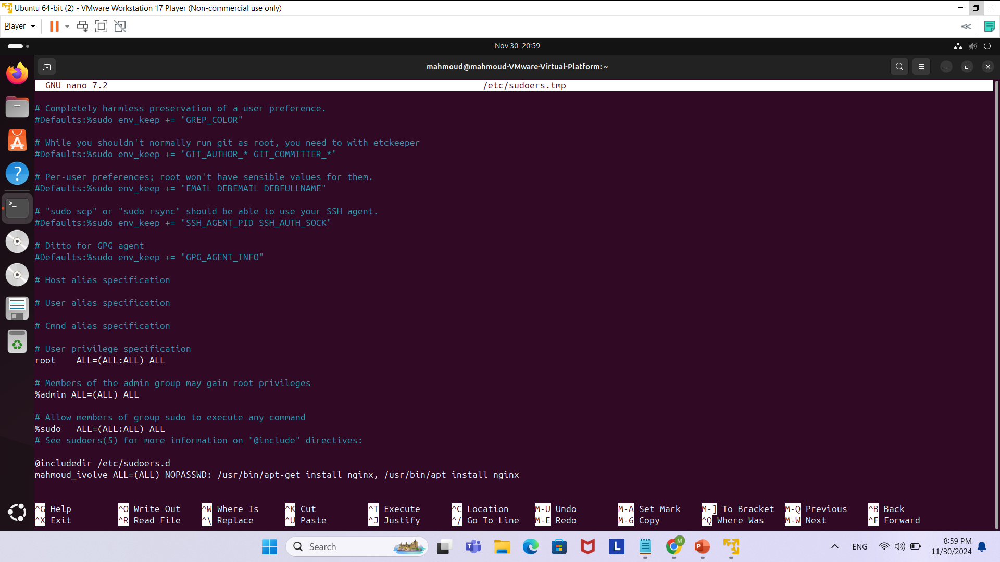
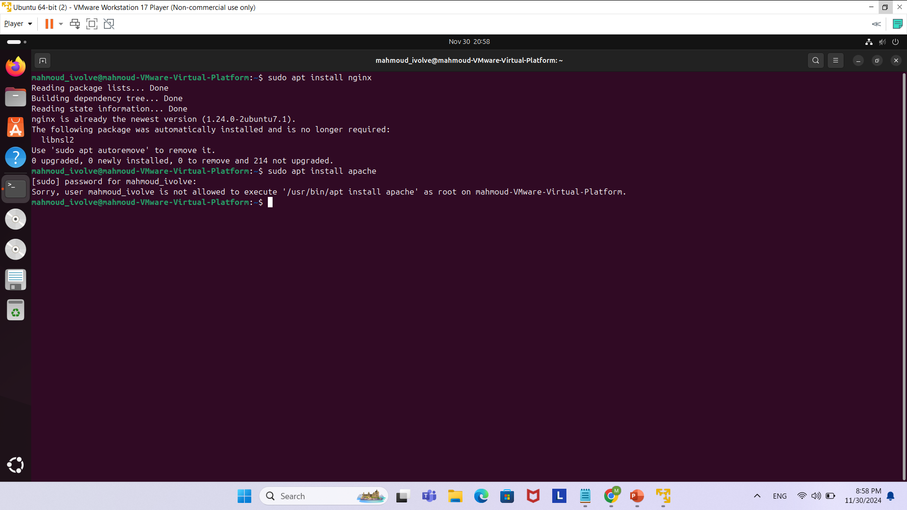

For this Lab we were required to create a group named ivolve and a new user added to this group with sudo privilges to only download nginx.
First , I created a a group with the command 'sudo groupadd iVolve', then I created a user with the command 'sudo adduser <username>'
and added that user to the group with the command 'sudo usermod -aG iVolve <username> '
Here is a screenshot for this:

Then I went on and did the command 'sudo visudo' and added for the user the command to only have sudo privilege like in this screenshot:

And here is the final thing, to install nginx using sudo, and then trying to install another pkg just to check we only have sudo permission for that user for nginx:

