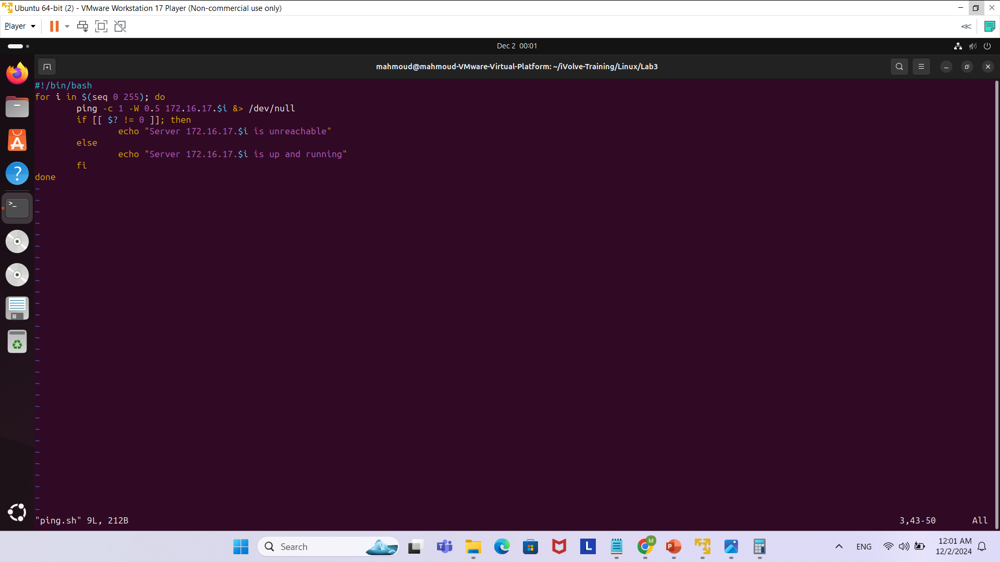
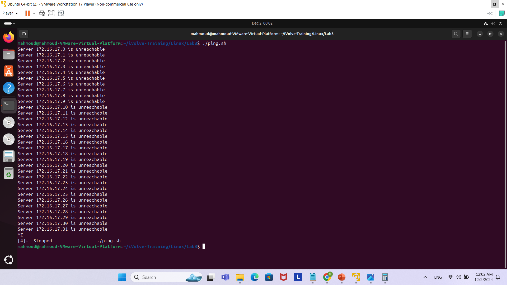

In Lab3 I was tasked to create a shell script to ping every server starting from 172.16.17.0 to 172.16.17.255 and if the ping was a success I would display a message that says server x is up and running and it failed I would display a message that said server x is unreachable.
So first of all what I did in my bash script was a for loop to iterate from the number 0 to 255, and added it next to the 172.16.17.$i so like this it will iterate untill 255.
After that I made the ping command, with a count of 1 as to not continue pinging infitely, also as to not wait a long time for a response, I changed the output response time to be 0.5 seconds using the -W 0.5 command and since we do not want the stdout or error to be displayed on the command line, I made them both go to /dev/null.
Then I created an if condition inside the for loop, if the command output is not equal to 0, this means that if the command ran unsuccessfully, to echo a message saying server x is unreachable, else if the output of the command is equal to 0 then a message saying Server x is up and running.
Here are screenshots for clarifying:

